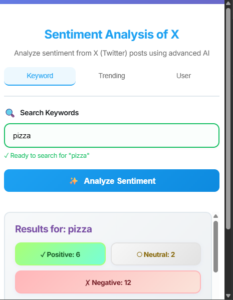
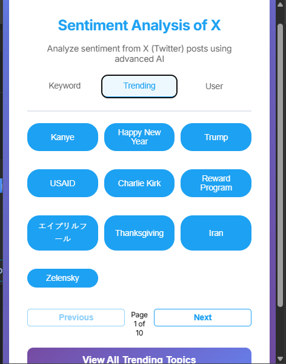
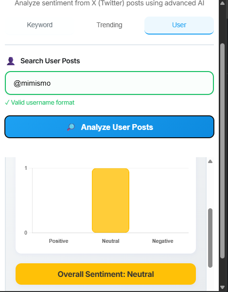
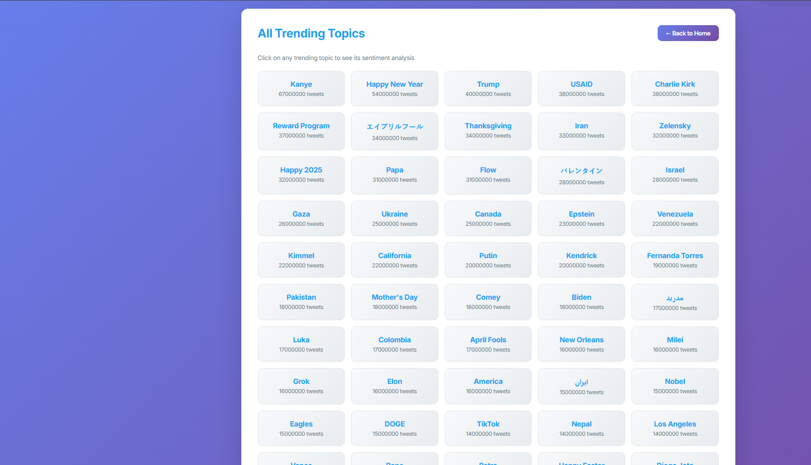

<h1 align="center">Sentiment Analysis of X (Twitter)</h1>

<p align="center">
This project performs advanced sentiment analysis on X (Twitter) posts using deep learning and natural language processing. It leverages a pre-trained transformer model (RoBERTa) fine-tuned on Twitter data to classify posts as Positive, Negative, or Neutral. The system includes a Flask backend API, a browser extension for easy access, and multiple web interfaces with interactive visualizations including bar charts showing sentiment distribution across analyzed posts.
</p>

---

<h2>Languages, Libraries, Tools, Frameworks, Concepts</h2>

- **Python**
- **JavaScript**
- **Flask**
- **HTML/CSS**
- **Anaconda** 
- **PyTorch**
- **Transformers (Hugging Face)**
- **NumPy**
- **Pandas**
- **Chart.js** (Data Visualization)
- **Datasets (Hugging Face)**
- **Natural Language Processing (NLP)**
- **Deep Learning**
- **Sentiment Analysis**
- **REST APIs**
- **Fetch API**
- **Browser Extensions (Manifest V3)**
- **JSON**
- **CORS (Cross-Origin Resource Sharing)**

<h2>Features</h2>

- 🔍 **Keyword Search**: Analyze sentiment for any keyword, hashtag, or topic
- 👤 **User Analysis**: Search and analyze posts from specific users (@username)
- 📈 **Trending Topics**: Browse and analyze 12,000+ trending topics with pagination
- 📊 **Interactive Visualizations**: Color-coded bar charts showing sentiment distribution
- 🎨 **Modern UI**: Beautiful gradient designs with responsive layouts
- 🌐 **Browser Extension**: Chrome/Edge extension for quick sentiment analysis
- 🔄 **Real-time Results**: Instant sentiment classification with detailed breakdown
- 📱 **Multiple Interfaces**: Web UI, trending topics page, and browser extension
- 💾 **Large Dataset Support**: Powered by Sentiment140 dataset (1.6M tweets)

<h2>Demo</h2>

### Browser Extension
The extension provides quick access to sentiment analysis with three tabs:
- **Keyword Tab**: Search for any topic with enhanced input validation
- **Trending Tab**: Browse trending topics with pagination
- **User Tab**: Analyze posts from specific users



### All Trending Topics Page
Interactive page showing all 12,036 trending topics with:
- Pagination controls with page jump feature
- Click-to-analyze functionality
- Visual sentiment breakdown with charts



### Results Display
Each analysis shows:
- Color-coded sentiment stats (Positive/Neutral/Negative)
- Interactive bar chart with percentages
- Overall sentiment indicator
- Individual tweet cards with sentiment labels





<h2>How to Run</h2>

<h3>1. Clone the repository:</h3>

```bash
git clone https://github.com/yourusername/Sentiment-Analysis-of-X.git
cd Sentiment-Analysis-of-X
```

<h3>2. Download Required Dataset:</h3>

Download the Sentiment140 dataset from Kaggle:  
[https://www.kaggle.com/datasets/kazanova/sentiment140](https://www.kaggle.com/datasets/kazanova/sentiment140)

Place the file `training.1600000.processed.noemoticon.csv` in the `backend/` folder.

<h3>3. Create Conda Environment (Recommended):</h3>

```bash
conda create -n sentiment-analysis python=3.9
conda activate sentiment-analysis
```

<h3>4. Install Dependencies:</h3>

With conda:
```bash
conda install pytorch pandas flask flask-cors transformers datasets
```
With pip:
```bash
pip install pytorch pandas flask flask-cors transformers datasets
```

<h3>5. (Optional) Fine-tune the Model:</h3>

To train/fine-tune the sentiment model on the dataset:
```bash
cd backend
python tweet_eval.py
```

<h3>6. Run the Flask Backend:</h3>

```bash
cd backend
python app.py
```

The server will start at `http://localhost:5000`

<h3>7. Access the Web Interface:</h3>

Open your browser and go to:
```
http://127.0.0.1:5000
```

To view all trending topics:
```
http://127.0.0.1:5000/all-trending
```

<h3>8. (Optional) Install Browser Extension:</h3>

1. Open your browser's extension manager:
   - Chrome: `chrome://extensions`
   - Edge: `edge://extensions`
2. Enable **Developer Mode**
3. Click **Load unpacked**
4. Select the `extension/` folder from the project
5. The extension icon will appear in your browser toolbar

**Note**: Make sure the Flask backend is running before using the extension!

<h2>Project Structure</h2>

```
Sentiment-Analysis-of-X/
├── backend/
│   ├── app.py                                  # Flask API server with endpoints
│   ├── data.py                                 # Data loading and query matching
│   ├── model.py                                # Transformer model inference
│   ├── tweet_eval.py                           # Model training/fine-tuning script
│   ├── sentiment_model.pt                      # Saved model weights
│   ├── training.1600000.processed.noemoticon.csv  # Sentiment140 dataset
│   ├── twitter-trending-hashtags.csv           # 12K+ trending topics
│   ├── sample_tweets.json                      # Sample data
│   └── templates/
│       ├── index.html                          # Main web interface
│       └── all-trending.html                   # Trending topics page
│
├── extension/
│   ├── manifest.json                           # Extension configuration
│   ├── popup.html                              # Extension popup UI
│   ├── popup.js                                # Extension logic
│   └── chart.umd.js                            # Chart.js library (local)
│
├── requirements.txt                            # Python dependencies
└── README                                      # This file
```

<h2>API Endpoints</h2>

### `POST /search`
Analyze sentiment for a search query.

**Request Body:**
```json
{
  "query": "keyword or @username",
  "search_mode": "keyword | user_tag | trending"
}
```

**Response:**
```json
{
  "query": "search term",
  "tweets": [...],
  "summary": {
    "positive": 10,
    "negative": 5,
    "neutral": 3,
    "overall": "Positive"
  }
}
```

### `GET /trending`
Get paginated trending topics.

**Query Parameters:**
- `page` (optional): Page number (default: 1)
- `per_page` (optional): Items per page (default: 50)

### `POST /trending-sentiment`
Analyze sentiment for a trending topic.

**Request Body:**
```json
{
  "topic": "trending topic name"
}
```

### `GET /all-trending`
Renders the full trending topics web page.

<h2>Technologies & Models</h2>

### Deep Learning Model
- **Model**: `cardiffnlp/twitter-roberta-base-sentiment`
- **Architecture**: RoBERTa (Robustly Optimized BERT Pretraining Approach)
- **Training**: Pre-trained on ~58M tweets, fine-tunable on Sentiment140
- **Classes**: 3 (Negative, Neutral, Positive)

### Dataset
- **Sentiment140**: 1.6 million tweets with sentiment labels
- **Twitter Trending Hashtags**: 12,036 trending topics with metadata

<h2>Notes</h2>

- First model load may take time as transformer weights are downloaded
- Keep the Flask backend running while using the browser extension
- The extension requires `http://localhost:5000` to be accessible
- Fine-tuning the model is optional; pre-trained weights work well
- Chart.js is bundled locally in the extension for CSP compliance

<h2>Future Enhancements</h2>

- [ ] Live Twitter API integration
- [ ] Historical sentiment trends
- [ ] Multi-language support
- [ ] Export results to CSV/PDF
- [ ] Sentiment comparison across topics
- [ ] Advanced filtering options

---

<p align="center">Made with ❤️ using PyTorch and Transformers</p>
